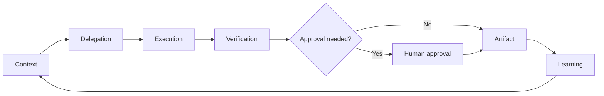

# Agentic Workflows

Field-tested operating patterns for turning AI assistance into safe,
measurable delegated work.

> Prompts are not the product. The product is the operating loop: context,
> delegation, verification, approval, artifact, learning.

## What this is

`agentic-workflows` is a curated playbook for using AI agents as controlled
operators, not magic chat boxes. It shows how to turn AI from a helpful chat
interface into a governed execution loop for real work.

The emphasis is not on clever phrasing. The emphasis is on the operating system
around the agent:

- what context the agent receives
- what authority it has
- how work is delegated
- what must be verified
- which actions require human approval
- what artifact is produced
- what lesson is saved for next time

This is not a prompt dump. Each workflow includes:

- when to use it
- required context
- authority boundaries
- expected artifact
- verification gate
- failure modes
- public-safe synthetic examples

## Who this is for

- founders, operators, chiefs of staff, and product leads adopting AI agents
- engineering and product teams designing human-in-the-loop workflows
- people evaluating what competent AI delegation looks like in practice
- anyone who wants less AI theater and more reliable AI-assisted execution

## The operating loop



A good agentic workflow is a loop, not a one-off prompt. It starts with scoped
context, delegates work with clear authority, verifies the result, gates risky
actions, produces an artifact, and captures reusable lessons.

## Core principles

1. **Artifacts over prompts** — a workflow should end in something durable:
   a memo, PR, issue tree, checklist, test result, decision log, or report.
2. **Human-controlled authority** — AI may draft, inspect, summarize, and
   propose; humans approve external writes, destructive actions, and sensitive
   decisions.
3. **Main-agent accountability** — parallel agents can help, but the operator
   synthesizes, verifies, and owns the recommendation.
4. **Private by default** — workflows are templates. Examples are synthetic.
   Private memory, secrets, client work, and internal context do not belong here.
5. **Learning compounds** — save reusable procedures and failure modes, not raw
   transcripts.

## Initial workflow set

| Workflow | Use it for | Output artifact |
| --- | --- | --- |
| [Agentic project pulse](workflows/project-pulse.md) | Project health and next actions | Pulse memo |
| [Approval boundary matrix](workflows/approval-boundary-matrix.md) | Defining what agents may do | Authority table |
| [Subagent delegation brief](workflows/subagent-delegation-brief.md) | Parallel task delegation | Brief + result spec |
| [Multi-agent review loop](workflows/multi-agent-review-loop.md) | Research/review/design sprints | Synthesized recommendation |
| [External action gate](workflows/external-action-gate.md) | Sending/posting/commenting/publishing | Approval checklist |
| [Learning extractor](workflows/learning-extractor.md) | Turning hard-won fixes into reusable knowledge | Lesson or skill proposal |
| [Research-to-decision pipeline](workflows/research-to-decision.md) | Research that must become a decision | Decision memo |
| [Repo triage workflow](workflows/repo-triage.md) | Auditing unfamiliar codebases | Triage report |

## Why this is different

Most public AI repositories show prompts, vendor skills, or tool recipes. This
repo shows the operating layer around AI work: delegation contracts, approval
gates, verification standards, learning loops, and measurable artifacts.

The goal is to make AI work safer and more legible, especially when agents touch
real projects, code, tasks, or external systems.

## Safety posture

All examples are synthetic. Do not commit secrets, private conversations,
client/employer material, real account IDs, internal repo names, or hidden system
prompts. See [Publication policy](PUBLICATION_POLICY.md).

## Repository layout

```text
principles/   Core operating beliefs
workflows/    Reusable playbooks
templates/    Copy/paste templates
examples/     Synthetic case studies
diagrams/     Visual explanations
```

## Contributing

Contributions should improve public-safe workflows, templates, examples, or
safety practices. See [Contributing](CONTRIBUTING.md).

## License

CC BY 4.0. See [License](LICENSE.md).
