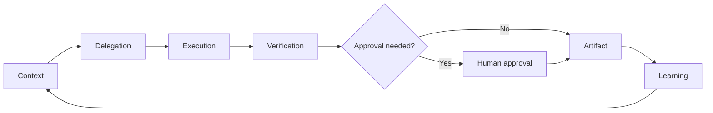

# Agentic Workflows

Repo-native operating files for controlled AI work.

> Prompts are not the product. The product is the operating loop: context,
> delegation, verification, approval, artifact, learning.

## What this is

`agentic-workflows` turns AI workflows into repo-native operating files:
validate them, render runbooks, audit authority, and compile them into agent
skills.

It is still a playbook, but v2 adds a runnable foundation:

- `.workflow.yml` files for executable-style workflow definitions
- a machine-readable workflow schema
- a Bun CLI for validation, runbook rendering, authority audit, and scaffolding
- repo templates for `AGENTS.md` and skill drafts

The emphasis is not on clever phrasing. The emphasis is on the operating system
around the agent:

- what context the agent receives
- what authority it has
- how work is delegated
- what must be verified
- which actions require human approval
- what artifact is produced
- what lesson is saved for next time

This is not a prompt dump. Each workflow includes:

- when to use it
- required context
- authority boundaries
- expected artifact
- verification gate
- failure modes
- public-safe synthetic examples

## Quick start

Requirements:

- [Bun](https://bun.sh/)

Run the CLI from the repo root:

```sh
bun run validate
bun cli/aw.ts check
bun cli/aw.ts runbook workflows/repo-triage.workflow.yml
bun cli/aw.ts audit workflows/research-to-decision.workflow.yml
bun cli/aw.ts new workflow customer-feedback-triage
```

CLI commands:

```text
aw validate <workflow>
aw check [workflow...]
aw runbook <workflow>
aw audit <workflow>
aw new workflow <name>
```

## Who this is for

- founders, operators, chiefs of staff, and product leads adopting AI agents
- engineering and product teams designing human-in-the-loop workflows
- people evaluating what competent AI delegation looks like in practice
- anyone who wants less AI theater and more reliable AI-assisted execution

## The operating loop



A good agentic workflow is a loop, not a one-off prompt. It starts with scoped
context, delegates work with clear authority, verifies the result, gates risky
actions, produces an artifact, and captures reusable lessons.

## Core principles

1. **Artifacts over prompts** — a workflow should end in something durable:
   a memo, PR, issue tree, checklist, test result, decision log, or report.
2. **Human-controlled authority** — AI may draft, inspect, summarize, and
   propose; humans approve external writes, destructive actions, and sensitive
   decisions.
3. **Main-agent accountability** — parallel agents can help, but the operator
   synthesizes, verifies, and owns the recommendation.
4. **Private by default** — workflows are templates. Examples are synthetic.
   Private memory, secrets, client work, and internal context do not belong here.
5. **Learning compounds** — save reusable procedures and failure modes, not raw
   transcripts.

## Executable workflow files

Executable-style examples live beside the markdown playbooks:

| Workflow file | Use it for | Try it |
| --- | --- | --- |
| [repo-triage.workflow.yml](workflows/repo-triage.workflow.yml) | Mapping an unfamiliar repo before edits | `bun cli/aw.ts runbook workflows/repo-triage.workflow.yml` |
| [research-to-decision.workflow.yml](workflows/research-to-decision.workflow.yml) | Research that must end in a recommendation | `bun cli/aw.ts audit workflows/research-to-decision.workflow.yml` |

The schema is [schema/workflow.schema.json](schema/workflow.schema.json).

Each workflow declares:

- `name`
- `goal`
- `trigger`
- `inputs`
- `allowed_tools`
- `authority`
- `risk_level`
- `required_permissions`
- `external_side_effects`
- `destructive_actions`
- `dry_run`
- `approval_required`
- `steps`
- `verification`
- `artifacts`
- `memory_update`

## Authority levels

| Level | Meaning |
| --- | --- |
| `read_only` | Inspect, summarize, and recommend. Do not modify files or external systems. |
| `local_write` | Modify files in the local repo or workspace. Do not write to external systems. |
| `external_draft` | Draft external-facing messages, issues, posts, or PR text. Do not send or publish. |
| `external_write_requires_approval` | Prepare an external write, then stop for explicit human approval before execution. |
| `destructive_forbidden` | Destructive actions are outside scope, even with tool access. |

## Markdown playbooks

| Workflow | Use it for | Output artifact |
| --- | --- | --- |
| [Agentic project pulse](workflows/project-pulse.md) | Project health and next actions | Pulse memo |
| [Approval boundary matrix](workflows/approval-boundary-matrix.md) | Defining what agents may do | Authority table |
| [Subagent delegation brief](workflows/subagent-delegation-brief.md) | Parallel task delegation | Brief + result spec |
| [Multi-agent review loop](workflows/multi-agent-review-loop.md) | Research/review/design sprints | Synthesized recommendation |
| [External action gate](workflows/external-action-gate.md) | Sending/posting/commenting/publishing | Approval checklist |
| [Learning extractor](workflows/learning-extractor.md) | Turning hard-won fixes into reusable knowledge | Lesson or skill proposal |
| [Research-to-decision pipeline](workflows/research-to-decision.md) | Research that must become a decision | Decision memo |
| [Repo triage workflow](workflows/repo-triage.md) | Auditing unfamiliar codebases | Triage report |

## Why this is different

Most public AI repositories show prompts, vendor skills, or tool recipes. This
repo shows the operating layer around AI work: delegation contracts, approval
gates, verification standards, learning loops, and measurable artifacts.

The goal is to make AI work safer and more legible, especially when agents touch
real projects, code, tasks, or external systems.

## Safety posture

All examples are synthetic. Do not commit secrets, private conversations,
client/employer material, real account IDs, internal repo names, or hidden system
prompts. See [Publication policy](PUBLICATION_POLICY.md).

## Repository layout

```text
cli/         Bun CLI for workflow validation, runbooks, audits, and scaffolds
principles/   Core operating beliefs
schema/      Machine-readable workflow schema
workflows/   Reusable playbooks and executable-style workflow files
templates/   Copy/paste templates, AGENTS.md template, skill draft template
examples/     Synthetic case studies
diagrams/     Visual explanations
```

## Contributing

Contributions should improve public-safe workflows, templates, examples, or
safety practices. See [Contributing](CONTRIBUTING.md).

## License

CC BY 4.0. See [License](LICENSE.md).
