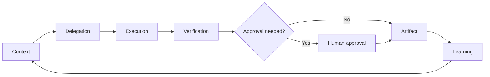

# Agentic operating loop

## How to read it

- **Context** — give the agent the smallest useful scope.
- **Delegation** — define goal, authority, forbidden actions, and output.
- **Execution** — let the agent work, often with subagents for independent lanes.
- **Verification** — inspect evidence, tests, sources, diffs, or tracker state.
- **Approval** — gate external-visible, destructive, or privacy-sensitive actions.
- **Artifact** — produce a durable output, not just chat.
- **Learning** — save reusable procedures and failure modes, not raw transcripts.
